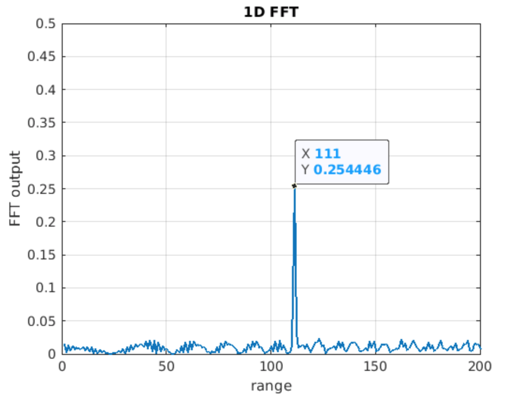
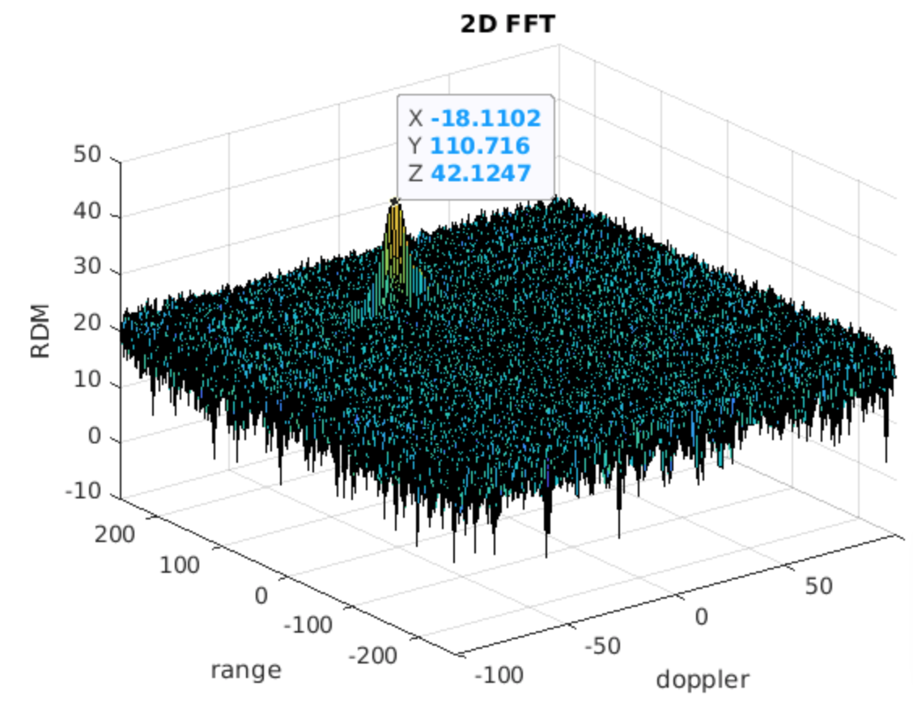

# 2D CFAR 
2D FFT, Doppler effect and CFAR implementation with matlab

## FMCW Waveform Design
FMCW waveform. 
Bandwidth (B)
chirp time (Tchirp) 
slope of the chirp = 2.0455e+13

## 1D FFT (1st order FFT)
Implement the Range FFT on the Beat or Mixed Signal and plot the result.
generate a peak at the correct range, i.e the initial position of target assigned with an error margin of +/- 10 meters.

## 2D FFT (2nd order FFT)

## Simulation Loop 
Simulate Target movement and calculate the beat or mixed signal for every timestamp
A beat signal should be generated such that once range FFT implemented, it gives the correct range i.e the initial position of target assigned with an error margin of +/- 10 meters.

## Implementation steps for the 2D CFAR process
Implement the 2D CFAR process on the output of 2D FFT operation, i.e the Range Doppler Map.
The 2D CFAR processing should be able to suppress the noise and separate
the target signal

## Selection of Training, Guard cells and offset.

## suppress the non-thresholded cells at the edges.
2D CFAR suppress the noise and separate the target signal
